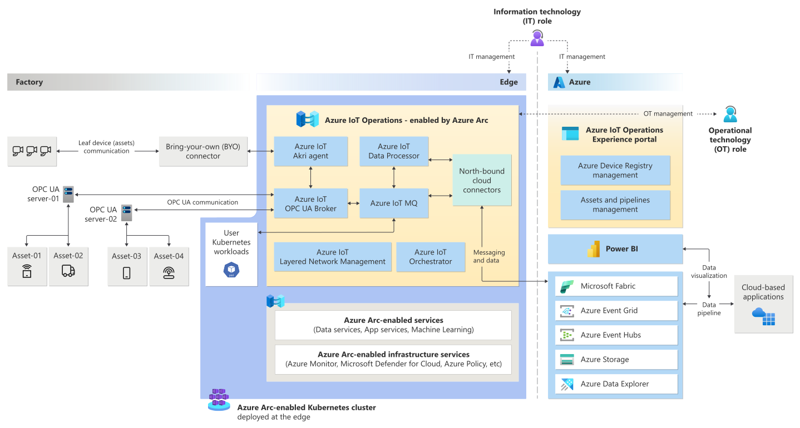

### What is Azure IoT Operations Preview?

_Azure IoT Operations Preview_ is a unified data plane for the edge. It's composed of a set of modular, scalable, and highly available data services that run on Azure Arc-enabled edge Kubernetes clusters. It enables data capture from various different systems and integrates with data modeling applications such as Microsoft Fabric to help organizations deploy the industrial metaverse.

Azure IoT Operations:

* Is built from ground up by using Kubernetes native applications.
* Includes an industrial-grade, edge-native MQTT broker that powers event-driven architectures.
* Is highly extensible, scalable, resilient, and secure.
* Lets you manage all edge services from the cloud by using Azure Arc.
* Can integrate customer workloads into the platform to create a unified solution.
* Supports GitOps configuration as code for deployment and updates.
* Natively integrates with [Azure Event Hubs](../../event-hubs/azure-event-hubs-kafka-overview.md), [Azure Event Grid's MQTT broker](../../event-grid/mqtt-overview.md), and [Microsoft Fabric](/fabric/) in the cloud.

### Architecture overview

There are two core elements in the Azure IoT Operations Preview architecture:

* **Azure IoT Operations Preview**. The set of data services that run on Azure Arc-enabled edge Kubernetes clusters. It includes the following services:
  * **Azure IoT Data Processor Preview** - a configurable data processing service that can manage the complexities and diversity of industrial data. Use Data Processor to make data from disparate sources more understandable, usable, and valuable.
  * **Azure IoT MQ Preview** - an edge-native MQTT broker that powers event-driven architectures.
  * **Azure IoT OPC UA Broker Preview** - an OPC UA broker that handles the complexities of OPC UA communication with OPC UA servers and other leaf devices.
* **Azure IoT Operations (preview) portal**. This web UI provides a unified experience for operational technologists to manage assets and Data Processor pipelines in an Azure IoT Operations deployment.