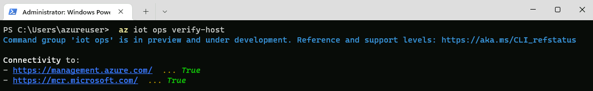
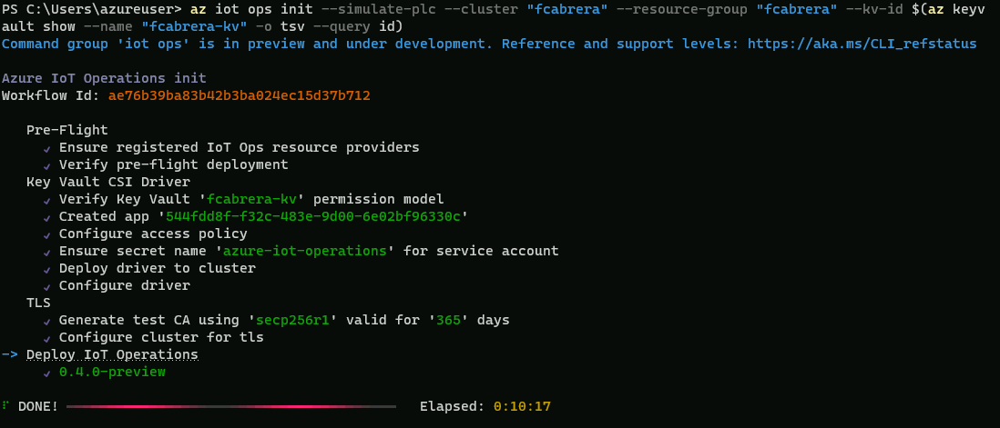

In this module, you will:

- Verify that the host configurations are correct
- Deploy Auzre IoT Operations to the cluster

## Instructions

1. Install the Azure IoT Operations (AIO) cli extension ([azure-iot-ops](https://github.com/Azure/azure-iot-ops-cli-extension))

   ```powershell
   az extension add --upgrade --name azure-iot-ops
   ```

1. Use the Azure IoT Operations extension for Azure CLI to verify that your cluster host is configured correctly for deployment by using the [verify-host](/cli/azure/iot/ops#az-iot-ops-verify-host) command on the cluster host:

    ```powershell
    az iot ops verify-host
    ```

   

1. Create an Azure Key Vault. Replace the placeholder parameters with your own information.

   | Placeholder | Value |
   | ----------- | ----- |
   | `RESOURCE_GROUP` | The name of your resource group that contains the connected cluster. |
   | `KEYVAULT_NAME` | A name for a new key vault. |
   | | | 

   ```powershell
   az keyvault create --enable-rbac-authorization false --name "<KEYVAULT_NAME>" --resource-group "<RESOURCE_GROUP>"
   ```

   | ℹ️ Note                                   | 
   |------------------------------------------|
   | _You can use an existing key vault for your secrets, but verify that the **Permission model** is set to **Vault access policy**. You can check this setting in the Azure portal in the **Access configuration** section of an existing key vault. Or use the [az keyvault show](/cli/azure/keyvault#az-keyvault-show) command to check that `enableRbacAuthorization` is false._ | 
   | | 

1. Run the following CLI command on your development machine or in your codespace terminal. Replace the placeholder parameters with your own information.

   | Placeholder | Value |
   | ----------- | ----- |
   | `CLUSTER_NAME` | The name of your connected cluster. |
   | `RESOURCE_GROUP` | The name of your resource group that contains the connected cluster. |
   | `KEYVAULT_NAME` | The name of your key vault. |
   | | |

   ```powershell
   az iot ops init --simulate-plc --cluster <CLUSTER_NAME> --resource-group <RESOURCE_GROUP> --kv-id $(az keyvault show --name <KEYVAULT_NAME> -o tsv --query id)
   ```

   If you get an error that says *Your device is required to be managed to access your resource*, run `az login` again and make sure that you sign in interactively with a browser.

   | ℹ️ Note                                   | 
   |------------------------------------------|
   | _If you've run `az iot ops init` before, it automatically created an app registration in Microsoft Entra ID for you. You can reuse that registration rather than creating a new one each time. To use an existing app registration, add the optional parameter `--sp-app-id <APPLICATION_CLIENT_ID>`._ | 
   | | 

   

1. These quickstarts use the **OPC PLC simulator** to generate sample data. To configure the simulator for the quickstart scenario, run the following command:

   | ℹ️ Note                                   | 
   |------------------------------------------|
   | _Don't use the following example in production, use it for simulation and test purposes only. The example lowers the security level for the OPC PLC so that it accepts connections from any client without an explicit peer certificate trust operation._ | 
   | | 

   ```powershell
   az k8s-extension update --version 0.3.0-preview --name opc-ua-broker --release-train preview --cluster-name <CLUSTER_NAME> --resource-group <RESOURCE_GROUP> --cluster-type connectedClusters --auto-upgrade-minor-version false --config opcPlcSimulation.deploy=true --config opcPlcSimulation.autoAcceptUntrustedCertificates=true
   ```

1. View resources in your cluster

   While the deployment is in progress, you can watch the resources being applied to your cluster. You can use kubectl commands to observe changes on the cluster or, since the cluster is Arc-enabled, you can use the Azure portal.

   To view the pods on your cluster, run the following command:

   ```powershell
   kubectl get pods -n azure-iot-operations
   ```