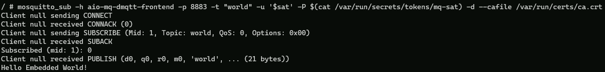

This sections shows different ways to test connectivity to Azure IoT MQ Preview with MQTT clients.

By default:

- IoT MQ deploys a TLS-enabled listener on port 8883 with ClusterIp as the service type. ClusterIp means that the broker is accessible only from within the Kubernetes cluster. To access the broker from outside the cluster, you must configure a service of type LoadBalancer or NodePort.
- IoT MQ only accepts Kubernetes service accounts for authentication for connections from within the cluster. To connect from outside the cluster, you must configure a different authentication method.

## Connect from a pod within the cluster with default configuration

The first option is to connect from within the cluster. This option uses the default configuration and requires no extra updates. The following examples show how to connect from within the cluster using plain Alpine Linux and a commonly used MQTT client, using the service account and default root CA cert.

1. Open Visual Sutdio Code and create a file `mqtt-client.yaml` with the following content: 

    ```yaml
    apiVersion: v1
    kind: Pod
    metadata:
    name: mqtt-client
    # Namespace must match IoT MQ BrokerListener's namespace
    # Otherwise use the long hostname: aio-mq-dmqtt-frontend.azure-iot-operations.svc.cluster.local
    namespace: azure-iot-operations
    spec:
    # Use the "mqtt-client" service account which comes with default deployment
    # Otherwise create it with `kubectl create serviceaccount mqtt-client -n azure-iot-operations`
    serviceAccountName: mqtt-client
    containers:
        # Mosquitto and mqttui on Alpine
    - image: alpine
        name: mqtt-client
        command: ["sh", "-c"]
        args: ["apk add mosquitto-clients mqttui && sleep infinity"]
        volumeMounts:
        - name: mq-sat
        mountPath: /var/run/secrets/tokens
        - name: trust-bundle
        mountPath: /var/run/certs
    volumes:
    - name: mq-sat
        projected:
        sources:
        - serviceAccountToken:
            path: mq-sat
            audience: aio-mq # Must match audience in BrokerAuthentication
            expirationSeconds: 86400
    - name: trust-bundle
        configMap:
        name: aio-ca-trust-bundle-test-only # Default root CA cert
    ```

1. Use `mqtt-client.yaml` to deploy the configuration. It should only take a few seconds to start.

    ```powershell
    kubectl apply -f mqtt-client.yaml   
    ```

1. Once the pod is running, use `kubectl exec` to run commands inside the pod.

    For example, to publish a message to the broker, open a shell inside the pod:

    ```bash
    kubectl exec --stdin --tty mqtt-client -n azure-iot-operations -- sh
    ```

1. Inside the pod's shell, run the following command to publish a message to the broker:

    ```console
    mosquitto_pub -h aio-mq-dmqtt-frontend -p 8883 -m "hello" -t "world" -u '$sat' -P $(cat /var/run/secrets/tokens/mq-sat) -d --cafile /var/run/certs/ca.crt
    ```

    You should thef following output:

    ```console
    $ mosquitto_pub -h aio-mq-dmqtt-frontend -p 8883 -m "hello" -t "world" -u '$sat' -P $(cat /var/run/secrets/tokens/mq-sat) -d --cafile /var/run/certs/ca.crt
    Client (null) sending CONNECT
    Client (null) received CONNACK (0)
    Client (null) sending PUBLISH (d0, q0, r0, m1, 'world', ... (5 bytes))
    Client (null) sending DISCONNECT
    ```

    The mosquitto client uses the service account token mounted at `/var/run/secrets/tokens/mq-sat` to authenticate with the broker. The token is valid for 24 hours. The client also uses the default root CA cert mounted at `/var/run/certs/ca.crt` to verify the broker's TLS certificate chain.

1. To subscribe to the topic, run the following command:

    ```console
    $ mosquitto_sub -h aio-mq-dmqtt-frontend -p 8883 -t "world" -u '$sat' -P $(cat /var/run/secrets/tokens/mq-sat) -d --cafile /var/run/certs/ca.crt
    Client (null) sending CONNECT
    Client (null) received CONNACK (0)
    Client (null) sending SUBSCRIBE (Mid: 1, Topic: world, QoS: 0, Options: 0x00)
    Client (null) received SUBACK
    Subscribed (mid: 1): 0
    ```

    The mosquitto client uses the same service account token and root CA cert to authenticate with the broker and subscribe to the topic.

1. Open a new PowerShell session and use the `mosquitto_pub` command again to publish something to the subscribed topic.

    ```console
    kubectl exec --stdin --tty mqtt-client -n azure-iot-operations -- sh
    ```
    And then publish the message to the topic

    ```console
    $ mosquitto_pub -h aio-mq-dmqtt-frontend -p 8883 -m "Hello Embedded World!" -t "world" -u '$sat' -P $(cat /var/run/secrets/tokens/mq-sat) -d --cafile /var/run/certs/ca.crt
    ```

    You should see the following:

    