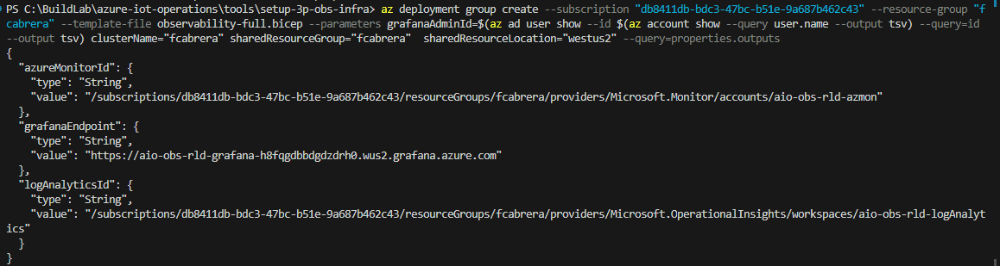
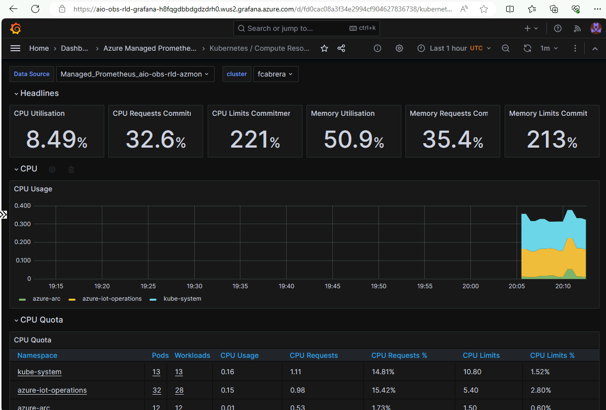
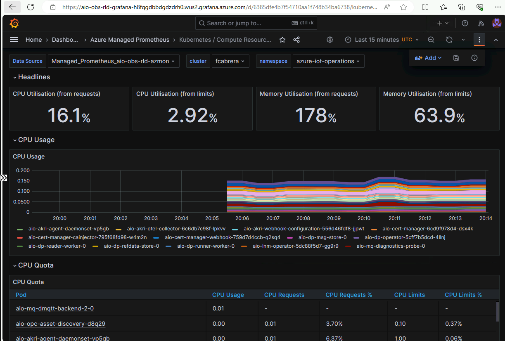

Observability provides visibility into every layer of your Azure IoT Operations configuration. It gives you insight into the actual behavior of issues, which increases the effectiveness of site reliability engineering. A

### Instructions

1. Run the following code to register providers with the subscription where your cluster is located:

    ```powershell
    az provider register -n "Microsoft.Insights"
    az provider register -n "Microsoft.AlertsManagement"
    ```

1. In your console, navigate to a local folder where you want to clone the Azure IoT Operations repo

    ```powershell
    cd C:\BuildLab
    ```

1. Clone the repo to your local machine, using the following command:

    ```shell
    git clone https://github.com/Azure/azure-iot-operations.git
    ```

1. Navigate to the following path in your local copy of the repo:

    ```powershell
    cd azure-iot-operations\tools\setup-3p-obs-infra
    ```

1. To deploy the observability components, run the following command. Use the subscription ID and resource group of your Arc-enabled cluster that you want to monitor.

    | ℹ️ Note                                   | 
    |------------------------------------------|
    | _To discover other optional parameters you can set, see the [bicep file](https://github.com/Azure/azure-iot-operations/blob/main/tools/setup-3p-obs-infra/observability-full.bicep). The optional parameters can specify things like alternative locations for cluster resources._ | 
    | | 
    
    ```console
    az deployment group create \
          --subscription <subscription-id> \
          --resource-group <cluster-resource-group> \
          --template-file observability-full.bicep \
          --parameters grafanaAdminId=$(az ad user show --id $(az account show --query user.name --output tsv) --query=id --output tsv) \
                        clusterName=<cluster-name> \
                        sharedResourceGroup=<shared-resource-group> \
                        sharedResourceLocation=<shared-resource-location> \
          --query=properties.outputs
    ```

    You should see an output like the following

    

1. Configure Prometheus metrics collection - Copy and paste the following configuration to a new file named *ama-metrics-prometheus-config.yaml*, and save the file:
    
    ```yml
    apiVersion: v1
    data:
      prometheus-config: |2-
            scrape_configs:
            - job_name: e4k
              scrape_interval: 1m
              static_configs:
              - targets:
                - aio-mq-diagnostics-service.azure-iot-operations.svc.cluster.local:9600
            - job_name: nats
              scrape_interval: 1m
              static_configs:
              - targets:
                - aio-dp-msg-store-0.aio-dp-msg-store-headless.azure-iot-operations.svc.cluster.local:7777
            - job_name: otel
              scrape_interval: 1m
              static_configs:
              - targets:
                - aio-otel-collector.azure-iot-operations.svc.cluster.local:8889
            - job_name: aio-annotated-pod-metrics
              kubernetes_sd_configs:
              - role: pod
              relabel_configs:
              - action: drop
                regex: true
                source_labels:
                - __meta_kubernetes_pod_container_init
              - action: keep
                regex: true
                source_labels:
                - __meta_kubernetes_pod_annotation_prometheus_io_scrape
              - action: replace
                regex: ([^:]+)(?::\\d+)?;(\\d+)
                replacement: $1:$2
                source_labels:
                - __address__
                - __meta_kubernetes_pod_annotation_prometheus_io_port
                target_label: __address__
              - action: replace
                source_labels:
                - __meta_kubernetes_namespace
                target_label: kubernetes_namespace
              - action: keep
                regex: 'azure-iot-operations'
                source_labels:
                - kubernetes_namespace
              scrape_interval: 1m
    kind: ConfigMap
    metadata:
      name: ama-metrics-prometheus-config
      namespace: kube-system
    ```

1. To apply the configuration file you created, run the following command:

    ```powershell
    kubectl apply -f ama-metrics-prometheus-config.yaml
    ```

1. Deploy dashboards to Grafana

    | ℹ️ Note                                   | 
    |------------------------------------------|
    | _Azure IoT Operations provides a collection of dashboards designed to give you many of the visualizations you need to understand the health and performance of your Azure IoT Operations deployment._ | 
    | | 


1. Sign in to the Grafana console, then look for **Azure Managed Prometheus**.

1. Select one of the default dashboards, for example **Kubernetes / Compute Resources / Cluster**

    

    