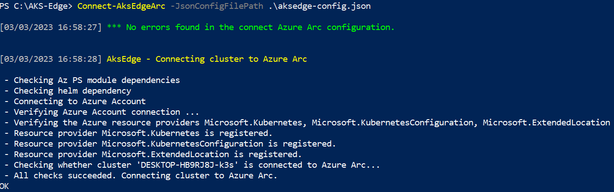
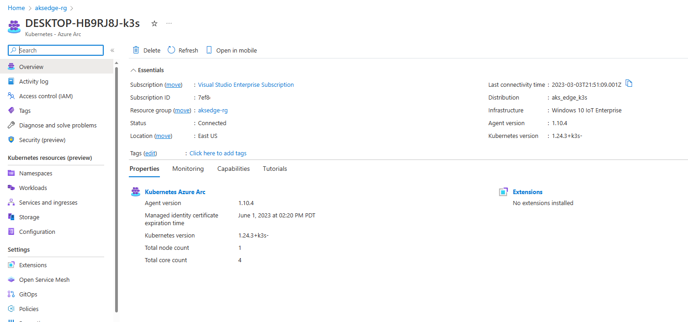
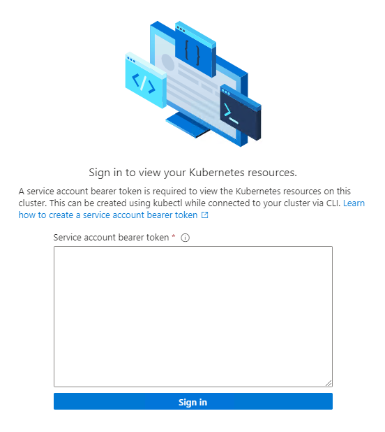
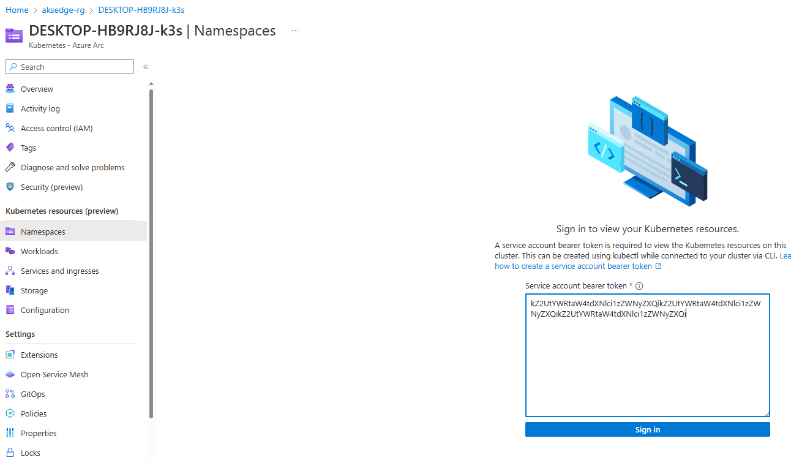
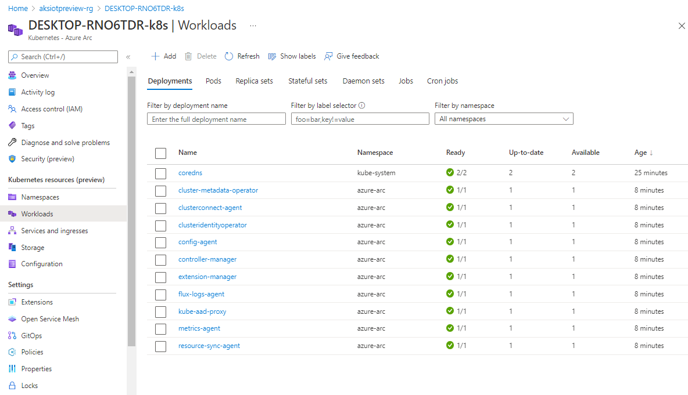

This sections describes how to connect your AKS Edge Essentials cluster to Azure Arc so that you can monitor the health of your cluster on the Azure portal.

### Instructions

1. Configure your Azure environment - Using the account information from previous section, fill the Azure subscription in the [aksedge-config.json](https://github.com/Azure/AKS-Edge/blob/main/tools/aksedge-config.json) file under the Arc section as described in the following table:

    | Attribute | Value type      |  Description |
    | :------------ |:-----------|:--------|
    |`ClusterName` | string | Provide a name for your cluster. The default value is `hostname_cluster`. |
    |`Location` | string | The location of your resource group. Choose the location closest to your deployment. |
    |`SubscriptionId` | GUID | Your subscription ID. In the Azure portal, select the subscription you're using and copy/paste the subscription ID string into the JSON. |
    |`TenantId` | GUID | Your tenant ID. In the Azure portal, search Microsoft Entra ID, which should take you to the **Default Directory** page. From here, you can copy/paste the tenant ID string into the JSON. |
    |`ResourceGroupName` | string | The name of the Azure resource group to host your Azure resources for AKS Edge Essentials. You can use an existing resource group, or if you add a new name, the system creates one for you. |
    |`ClientId` | GUID | Provide the application ID of the Azure service principal to use as credentials. AKS Edge Essentials uses this service principal to connect your cluster to Arc. You can use the **App Registrations** page in the Microsoft Entra resource page on the Azure portal, to list and manage the service principals in a tenant.|
    |`ClientSecret` | string | Provide the password for the service principal. |
    | | | 

1. Connect your cluster to Arc - Run `Connect-AksEdgeArc` to install and connect the existing cluster to Arc-enabled Kubernetes:

    ```powershell
    # Connect Arc-enabled kubernetes
    Connect-AksEdgeArc -JsonConfigFilePath .\aksedge-config.json
    ```
    
    | ℹ️ Note                                   | 
    |------------------------------------------|
    | _This step can take up to 10 minutes and PowerShell may become stuck on **Establishing Azure Connected Kubernetes for `your cluster name`**. PowerShell outputs `True` and returns to the prompt when the process is complete._ | 
    | | 

    

1. Once the process is complete, you can view your cluster in the Azure portal if you navigate to your resource group:

    

1. On the left panel, select the **Namespaces** option, under **Kubernetes resources (preview)**:
    
    

1. To view your Kubernetes resources, you need a bearer token.

    

1. You can also run `Get-AksEdgeManagedServiceToken` to retrieve your service token.

    

1. Now you can view resources on your cluster. The **Workloads** option shows the pods running in your cluster.

   ```powershell
   kubectl get pods --all-namespaces
   ```
   

1. Once the connection is finish, clean up the resources by disconnecting the cluster from Arc. Run `Disconnect-AksEdgeArc` to disconnect from the Arc-enabled Kubernetes.

    ```powershell
    # Disconnect Arc-enabled kubernetes
    Disconnect-AksEdgeArc -JsonConfigFilePath .\aksedge-config.json
    ```