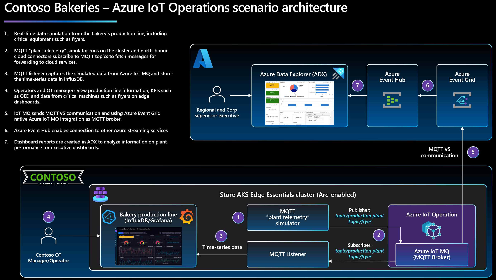

### Enhance operational insights at the edge using Azure IoT Operations (AIO)

Contoso Bakeries, a fictional company, requires dashboards and analytics on the edge (in its plant) and in Azure to provide real-time operational data to plant operators such as Operational Technology (OT) Managers, Operators, and Maintenance personnel. This includes insights into production line operations and key performance indicators (KPIs) like overall equipment effectiveness (OEE), downtime, and waste. A prime focus is on data from critical equipment like fryers. Additionally, regional executives and directors are interested in supervising main KPIs across multiple plants remotely.

### Architecture

The solution for Contoso will involve deploying the following:

- A Kubernetes cluster on the edge using [AKS Edge Essentials](https://learn.microsoft.com/azure/aks/hybrid/aks-edge-overview), managed by Azure Arc, which hosts various [Azure IoT Operations](https://learn.microsoft.com/azure/iot-operations/get-started/overview-iot-operations) services.
- A custom-developed MQTT-Simulator that mimics plant and fryer data, transmitting it to Azure IoT MQ via MQTT.
- An MQTT-listener service that captures this production line data, sending it to an open source [InfluxDb](https://www.influxdata.com/) on the edge, generating near real-time dashboards and analytics and visualizes it using [Grafana](https://Grafana.com/).
- An Azure IoT MQ connection with [Azure Event Grid namespace](https://learn.microsoft.com/azure/event-grid/create-view-manage-namespaces), an MQTT broker integrated into Azure, pushing data to Azure Event Grid and subsequently to [Azure Data Explorer](https://learn.microsoft.com/azure/data-explorer/).
- Azure Data Explorer dashboards and analytics for supervisory and executive roles monitoring multiple plants' operations.

    

| ℹ️ Note                                   | 
|------------------------------------------|
| _Currently, Azure IoT Operations is in preview._ | 
||

The following Jumpstart scenario will show how to create an AKS Edge Essentials cluster in Azure Windows Server VM and connect the Azure VM and AKS Edge Essentials cluster to Azure Arc.