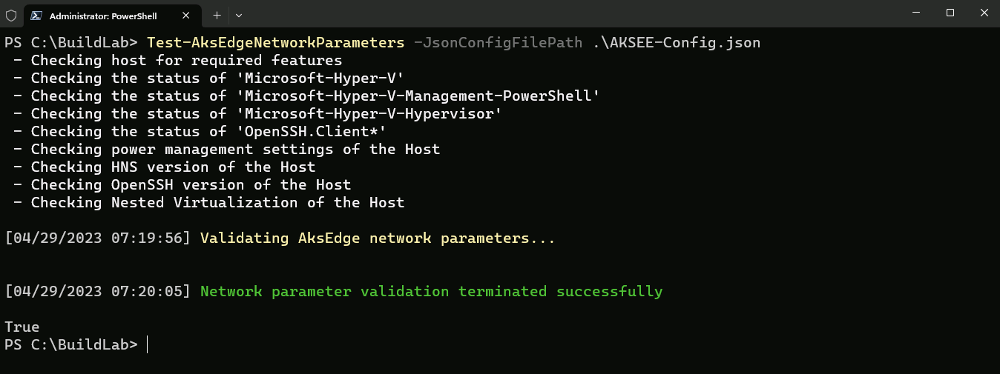
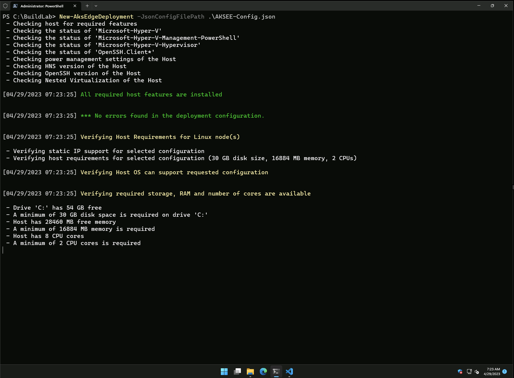
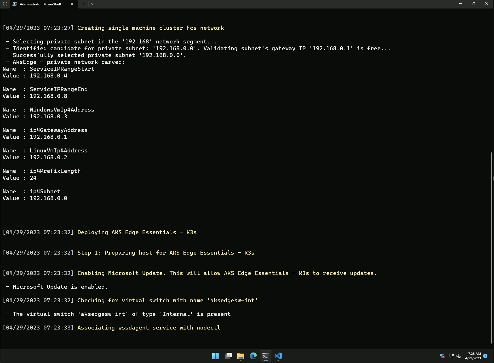
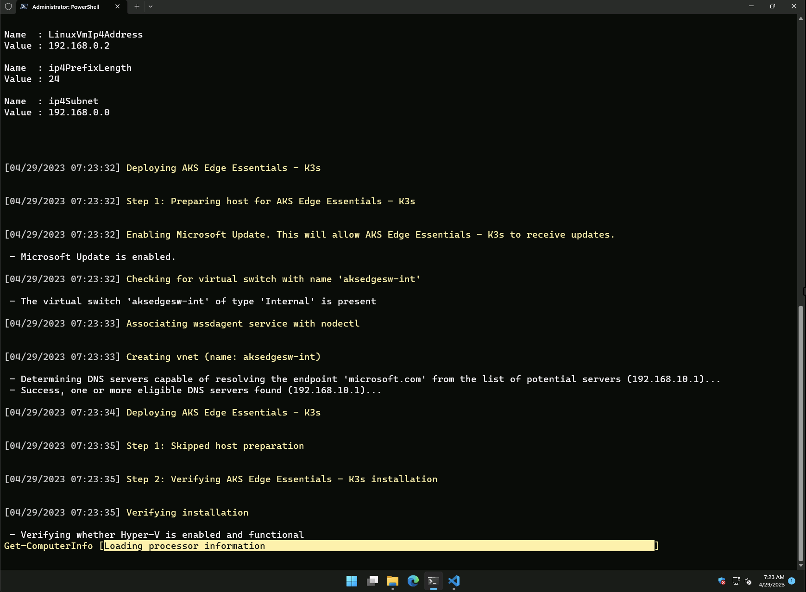
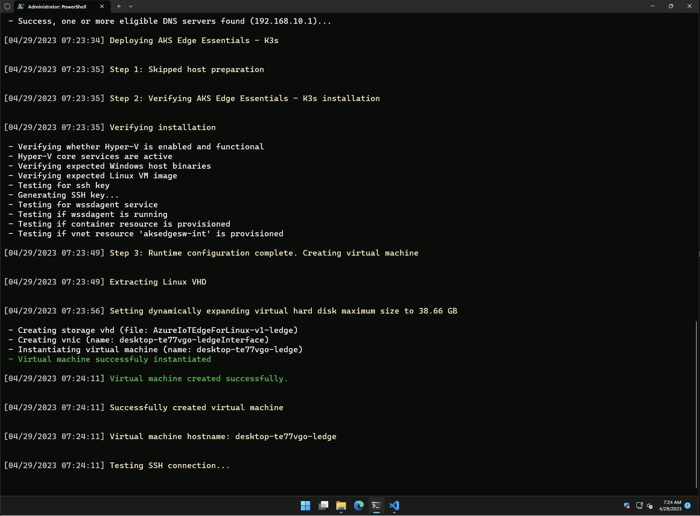
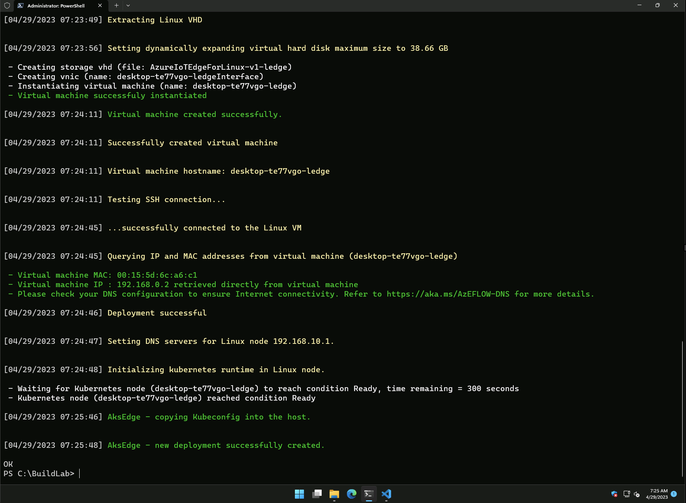
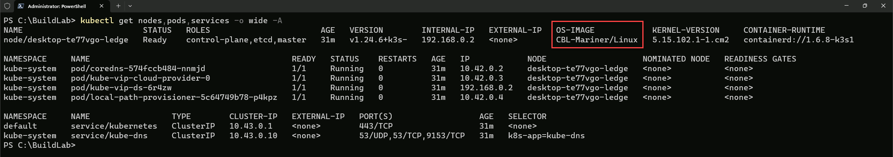

In this module, you will:

- Use the pre-created AKS-EE deployment JSON scheme file to deploy AKS Edge Essentials cluster.
- Validate the cluster deployment

### Instructions

1. To make sure our JSON scheme file configurations are correct and valid, from Windows Terminal, run the below PowerShell command (make sure you are still inside the _C:\BuildLab_ folder).

    ```powershell
    Test-AksEdgeNetworkParameters -JsonConfigFilePath .\AKSEE-Config.json
    ```

    

2. To start the cluster deployment, run the below PowerShell command and observe the deployment's various steps.

    ```powershell
    New-AksEdgeDeployment -JsonConfigFilePath .\AKSEE-Config.json
    ```

    

    

    

    

    


3. **Congratulations, you now have a new AKS Edge Essentials cluster!** 

    To validate the deployment, run the below _kubectl_ command.

    ```cmd
    kubectl get nodes,pods,services -o wide -A
    ```

    

    | ℹ️ Note                                   | 
    |------------------------------------------|
    | _As mentioned, in a single node cluster deployment, the Linux VM can act as both the control plane node and as a worker node. This curated VM is based on [Azure Linux](https://github.com/microsoft/azurelinux). CBL-Mariner is an internal Linux distribution for Microsoft's cloud infrastructure and edge products and services. CBL-Mariner is designed to provide a consistent platform for these devices and services and enhances Microsoft's ability to stay current on Linux updates. For more information, see [Azure Linux security](https://github.com/microsoft/azurelinux/blob/2.0/SECURITY.md). To learn more, click [here](https://learn.microsoft.com/en-us/azure/aks/hybrid/aks-edge-concept-clusters-nodes)._ | 