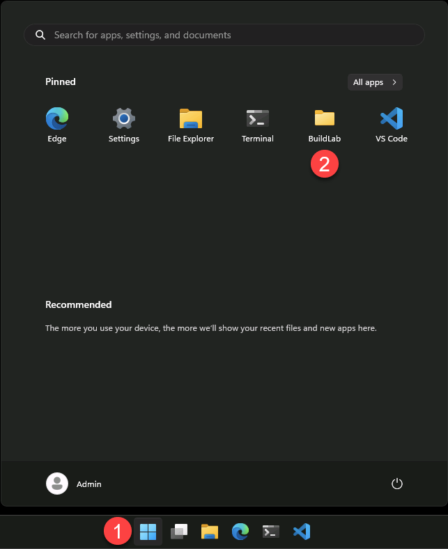
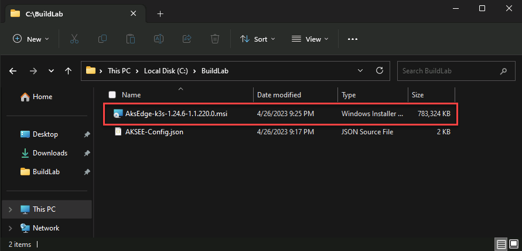
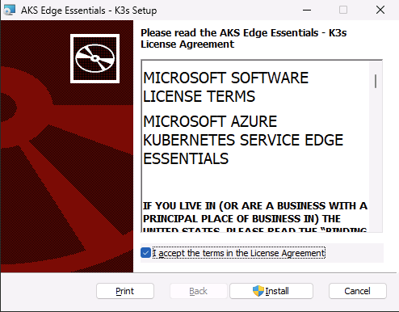
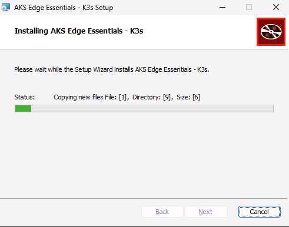
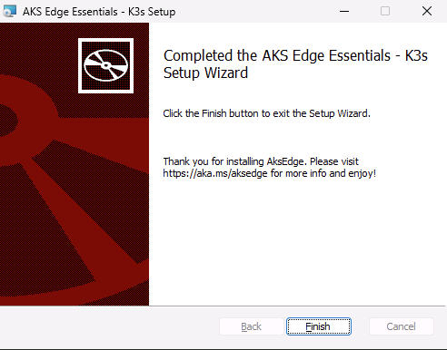
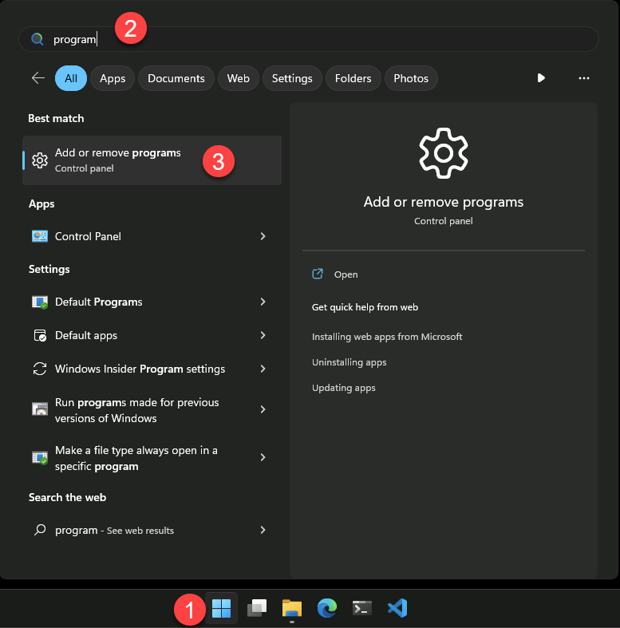
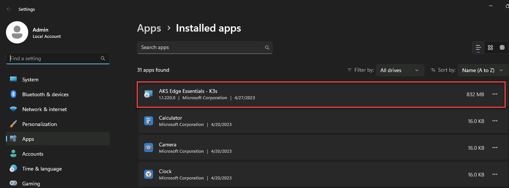
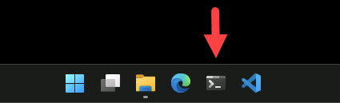
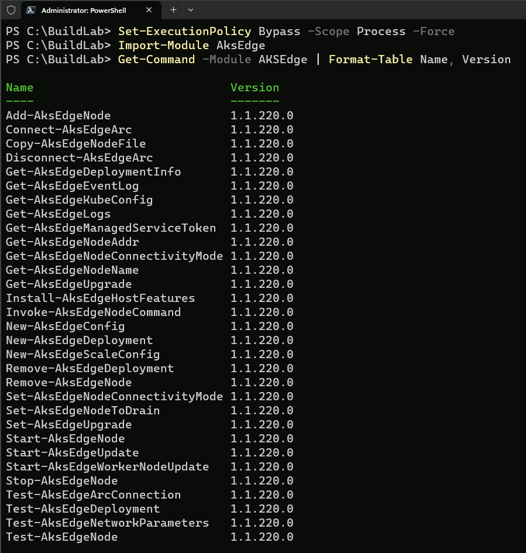
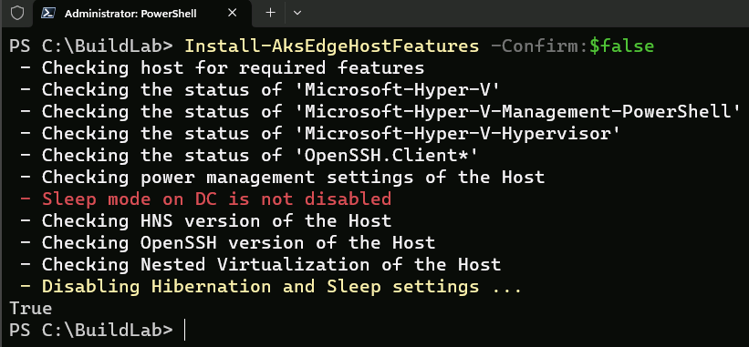

In this module, you will:

- Install the AKS Edge Essentials (AKS-EE) using the installer MSI binary.
- Install the AKS-EE PowerShell module.

### Host configuration

1. Click on the Start menu and click on the _BuildLab_ folder.

    

2. Start the installation using the _AksEdge.msi_ file. You can either use the installation graphical interface or the command line. Verify the MSI installation from the "Add or remove programs" settings.

    | ℹ️ Note                                   | 
    |------------------------------------------|
    | _AKS Edge Essentials supports both K8s and K3s. For the purpose of this lab, you will be installing the K3s distribution._ | 
    | | 

    

    

    

    

    

    

3. From the Windows Terminal, check the AKS-EE PowerShell modules using the below PowerShell command.

    

    ```powershell
    cd C:\BuildLab
    Set-ExecutionPolicy Bypass -Scope Process -Force
    Import-Module AksEdge
    Get-Command -Module AKSEdge | Format-Table Name, Version
    ```

    

4. Check device settings using the ```Install-AksEdgeHostFeatures -Confirm:$false``` command to validate the Hyper-V, SSH, and Windows Power settings on the machine.

    | ℹ️ Note                                   | 
    |------------------------------------------|
    | _You can safely ignore the **"Sleep mode on DC is not disabled"** message mark in red._ | 
    | | 

    