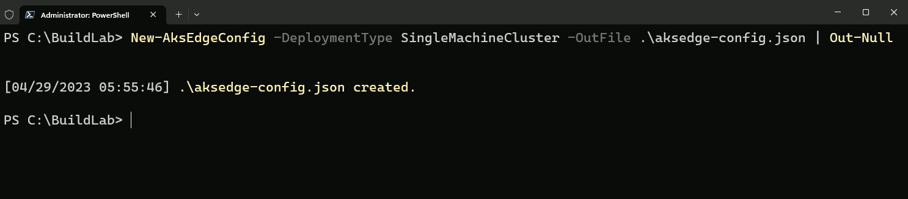
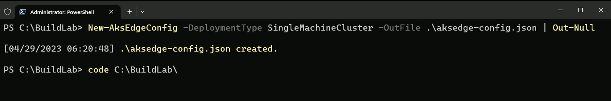
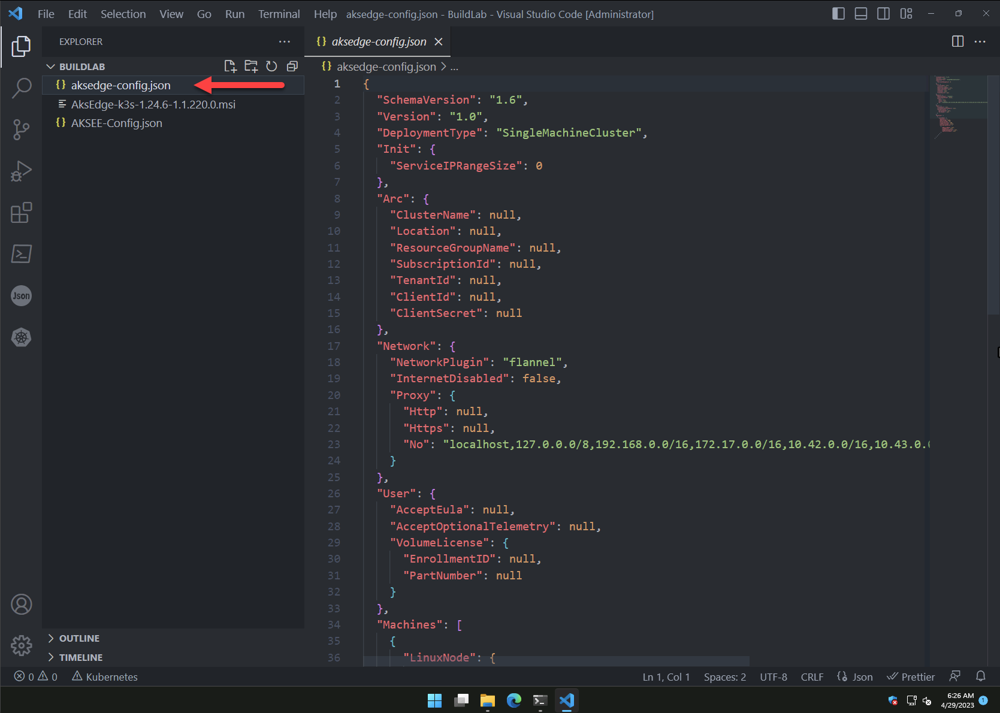
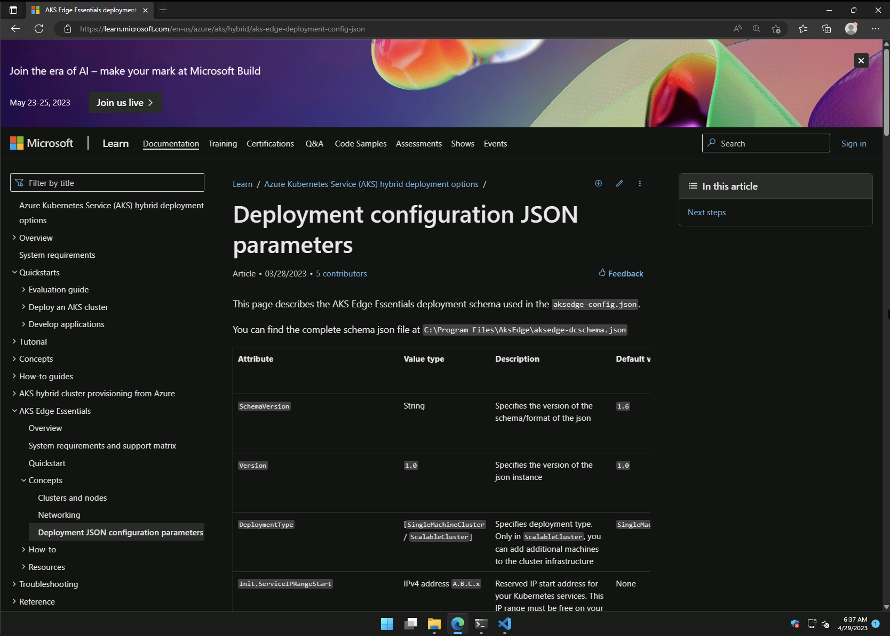
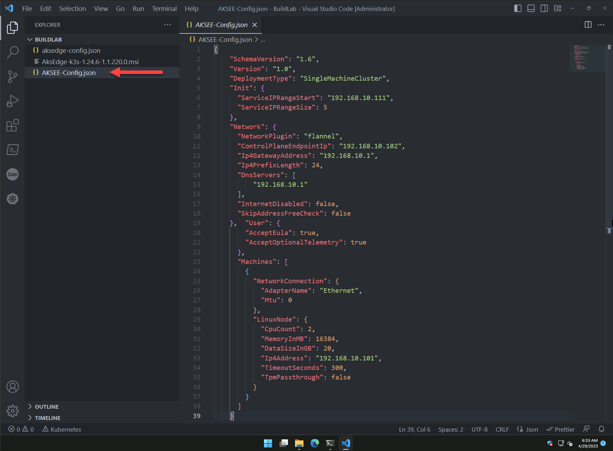

In this module, you will:

- Learn how to generate a vanilla AKS-EE deployment JSON scheme file.
- Review the JSON scheme file.

### Instructions

| ℹ️ Note                                   | 
|------------------------------------------|
| _You can deploy AKS Edge Essentials on either a single-machine or on multiple machines. In a single-machine Kubernetes deployment, both the Kubernetes control node and worker node run on the same machine. For the purpose of this lab, you will be deploying a single-machine base cluster._ | 
| | 

1.  AKS Edge Essentials cluster is deployed using a JSON scheme file. To generate a vanilla file, in Windows Terminal (**make sure you are still inside the _C:\BuildLab_ folder**), run the bellow command.

    ```powershell
    New-AksEdgeConfig -DeploymentType SingleMachineCluster -OutFile .\aksedge-config.json | Out-Null
    ```
    
    

2. To open the _C:\BuildLab_ folder in Visual Studio Code (VS Code), simply use the ```code C:\BuildLab``` command.

    

3. First, click on the newly generated file to review the AKS Edge Essentials JSON scheme.

        

    
    
    | ⚠️ Alert                               | 
    |------------------------------------------|
    | _To learn more about the JSON schema, point your attention to the lab instructor._   |
    | | 

    | ℹ️ Note                                   | 
    |------------------------------------------|
    | _[AKS Edge Essentials deployment configuration JSON parameters can be found here](https://learn.microsoft.com/en-us/azure/aks/hybrid/aks-edge-deployment-config-json). For the purpose of the lab, the team has provided a pre-populated JSON file for you to review._ | 
    | | 

4. In VS Code, open the _AKSEE-Config.json_ file.

    

5. Let's review the various key configurations:

    - As mentioned, we will be deploying a single-machine cluster.

    ```json
    "DeploymentType": "SingleMachineCluster"
    ```

    - Reserved IP start address for your Kubernetes services. This IP range must be free on your subnet.
    - Number of reserved IP start addresses for your Kubernetes services. Based on the size, a range of free IP addresses will be allocated to your subnet.

    ```json
    "Init": {
        "ServiceIPRangeStart": "192.168.10.111",
        "ServiceIPRangeSize": 5
    }
    ```

    - The below settings control the environment network configuration.

         | ℹ️ Note                                   | 
        |------------------------------------------|
        | _When deploying a K3s cluster, the default **NetworkPlugim** is [flannel](https://github.com/flannel-io/flannel). Although not part of this lab, when deploying a K8s cluster, the CNI (Container Network Interface) needs to be changed to [calico](https://docs.tigera.io/calico/latest/getting-started/kubernetes/quickstart)._ | 
        | | 

    ```json
    "Network": {
        "NetworkPlugin": "flannel",
        "ControlPlaneEndpointIp": "192.168.10.102",
        "Ip4GatewayAddress": "192.168.10.1",
        "Ip4PrefixLength": 24,
        "DnsServers": [
            "192.168.10.1"
        ]    
    }
    ```

    - The below settings control the cluster node compute, storage, and network configuration.

    ```json
    "Machines": [
        {
            "NetworkConnection": {
            "AdapterName": "Ethernet",
            "Mtu": 0
            },
            "LinuxNode": {
            "CpuCount": 2,
            "MemoryInMB": 16384,
            "DataSizeInGB": 20,
            "Ip4Address": "192.168.10.101",
            "TimeoutSeconds": 300,
            "TpmPassthrough": false
            }
        }
    ]
    ```
